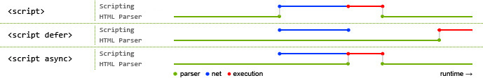

[TOC]
***

### 一、同步加载

平时使用最多的一种方式
```HTML
<script src="http://yourdomain.com/script.js"></script>
```

同步模式，又称为阻塞模式，会阻止浏览器的后续处理，停止后续的解析，只有当前加载成功，才能进行下一步操作。所以默认同步执行才是安全的。但这样如果js中有输出document内容、修改dom、重定向等行为，就会造成页面堵塞。所以一般建议把\<script\>标签放在\<body\>结尾处，这样尽可能减少页面阻塞。

### 二、异步加载

异步加载又叫非阻塞加载，浏览器在下载执行js的同时，还会继续进行后续页面的处理。

#### 1.Script DOM Element

async属性是HTML5中新增的异步支持。此方法被称为Script DOM Element方法。

但是这种加载方式执行完成之前会阻止onload事件的触发，而现在很多页面的代码都在onload时还执行额外的渲染工作，所以还是会阻塞部分页面的初始化处理。

```JS
(function(){
  var scriptEle = document.createElement("script");
  scriptEle.type = "text/javasctipt";
  scriptEle.async = true;
  scriptEle.src = "http://cdn.bootcss.com/jquery/3.0.0-beta1/jquery.min.js";
  var x = document.getElementsByTagName("head")[0];
  x.insertBefore(scriptEle, x.firstChild);        
 })();
```

#### 2.onload时的异步加载

这种方法只是把插入script的方法放在一个函数里面，然后放在window的onload方法里面执行，这样就解决了阻塞onload事件触发的问题。

注:DOMContentLoaded与load的区别。前者是在document已经解析完成，页面中的dom元素可用，但是页面中的图片，视频，音频等资源未加载完，作用同jQuery中的ready事件；后者的区别在于页面所有资源全部加载完毕。

```JS
(function(){
  if(window.attachEvent){
    window.attachEvent("load", asyncLoad);
  }else{
    window.addEventListener("load", asyncLoad);
  }
  var asyncLoad = function(){
    var ga = document.createElement('script'); 
    ga.type = 'text/javascript'; 
    ga.async = true; 
    ga.src = ('https:' == document.location.protocol ? 'https://ssl' : 'http://www') + '.google-analytics.com/ga.js'; 
    var s = document.getElementsByTagName('script')[0]; 
    s.parentNode.insertBefore(ga, s);
  }
)();
```

#### 3.async和defer属性

defer属性：会下载这个文件，并不执行，其后代码全部执行完毕之后，才会执行。
defer属性声明的脚本中将不会有document.write和dom修改。浏览器会并行下载其他有defer属性的script。而不会阻塞页面后续处理。注：所有的defer脚本必须保证按顺序执行。

async属性：HTML5新属性。会下载这个文件，当下载完成后，立即执行，同时中断其后代码的执行，执行完毕之后，其后代码才能继续执行。但是不能保证脚本按顺序执行。他们将在onload事件之前完成。

> 没有async属性，script将立即获取（下载）并执行，期间阻塞了浏览器的后续处理。如果有async属性，那么script将被异步下载并执行，同时浏览器继续后续的处理。

蓝色代表网络读取，红色代表执行时间，这两者都是针对脚本的；绿色线代表HTML解析。


#### 4.其他方法
由于JavaScript的动态性，还有很多异步加载方法： XHR Injection、 XHR Eval、 Script In Iframe、 Script defer属性、 document.write(script tag)。

XHR Injection(XHR 注入)：通过XMLHttpRequest来获取javascript，然后创建一个script元素插入到DOM结构中。ajax请求成功后设置script.text为请求成功后返回的responseText。

```JS
//获取XMLHttpRequest对象，考虑兼容性。
var getXmlHttp = function(){
  var obj;
  if (window.XMLHttpRequest)
    obj = new XMLHttpRequest();
  else
    obj = new ActiveXObject("Microsoft.XMLHTTP");
  return obj;
};
//采用Http请求get方式;open()方法的第三个参数表示采用异步(true)还是同步(false)处理
var xmlHttp = getXmlHttp();
xmlHttp.open("GET", "http://cdn.bootcss.com/jquery/3.0.0-beta1/jquery.min.js", true);
xmlHttp.send(); 
xmlHttp.onreadystatechange = function(){
  if (xmlHttp.readyState == 4 && xmlHttp.status == 200){
    var script = document.createElement("script");
    script.text = xmlHttp.responseText;
    document.getElementsByTagName("head")[0].appendChild(script);
  }
}
```
