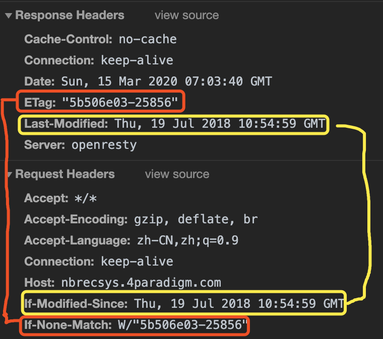

[TOC]
***

### 一、为什么要缓存

1.缓存的优点：
1）加快浏览器加载网页的速度，优化用户体验，让用户更加快速的打开页面
2）减少对服务器的访问次数，减轻服务器的负担
3）节省宽带(就是节省钱...，因为很多带宽服务其实是按流量来计费的，同样对用户也可以省4G、5G流量...也省钱了)

2.有啥缺点
如果资源一直被缓存了，那当资源发生更改时，用户就无法获取最新的信息了！所以缓存虽好，但不能乱用。

### 二、强缓存

强制把资源缓存起来

强缓存是利用http头中的Expires和Cache-Control两个字段控制的。

Expires：绝对时间(例：Fri, 01 Jan 1990 00:00:00 GMT)，代表资源的失效时间。就是说在这个时间之前缓存始终有效，始终会读取缓存数据。但是这样会有一个明显的缺点：因为它是一个绝对时间，当服务器时间与客户时间有偏差时，可能会导致缓存失效，比如用户随意修改了本地时间。

Cache-Control: max-age=2592001
包含参数：
1）max-age 表示资源的最大有效时间的“秒数”，是一个相对值，不会因为用户修改本地时间而导致失效。
2）public/private: public表示客户端和代理服务器（如CDN）都可以缓存，private（默认值）表示只有客户端可以缓存；
3）no-cache/no-store: no-cache客户端缓存内容，但是是否使用缓存需要经过协商缓存来验证决定；no-store 所有内容都不会被缓存，即不使用强缓存，也不使用协商缓存；

> Expires和Cache-Control可以在服务器端配置为同时启用，同时启用的时候Cache-Control优先级更高。

### 三、协商缓存

协商缓存就是强制缓存失效后，浏览器携带缓存标识向服务器发起请求，由服务器根据缓存标识决定是否使用缓存。

协商缓存是通过两对值来设置的： Last-Modified/If-Modified-Since  和 ETag/If-None-Match

Last-Modified/If-Modified-Since
浏览器第一次发送请求，让服务器端在response header中返回请求的资源上次更新时间（Last-Modified的值），浏览器会存下这个时间
当浏览器下次请求时，request header中带上If-Modified-Since(即保存的Last-Modified的值)。根据浏览器发送的修改时间和服务器的修改时间进行比对，一致的话代码资源没有改变，服务端返回正文为空的响应，让浏览器在缓存中读取资源，从而减少请求消耗。

缺点：
1.从上图中可以看出Last-Modified保存的是绝对时间，并且是精确到秒，所以如果资源在1秒内修改了多次，那就无法识别。
2.对于文件只改变了修改时间，内容不变，这时候也会使缓存失效，其实这个时候我们是不希望客户端重新请求的。
3.某些服务器不能精确的得到文件的最后修改时间

ETag/If-none-match
1.浏览器第一次发送一个请求得到ETag的值，然后在下一次请求request header中带上If-none-match(即保存的ETag值)
2.通过发送的ETag的值和服务器重新生成的ETag的值进行比对，如果一致代表资源没有改变，服务器返回的正文为空响应，让浏览器从缓存中读取资源，从而减少请求消耗。

ETag的工作机制和Last-Modified基本一致。但是ETag是对资源内容使用抗碰撞散列函数，使用最近修改的时间戳的哈希值。ETag解决了Last-Modified上述问题。

缺点：
ETag每次服务器端生成都需要进行读写操作(因为要生成hash)，而Last-Modified只需要读取操作，ETag消耗更大一谢。

总结：
Last-Modified和ETag同样可以同时配置，服务器会优先验证ETag，一致的情况下，才会继续对比Last-Modified，最后才决定是否返回304。
精确度上，ETag更高，性能上ETag稍微低一点(因为要生成hash)
由此可见，协商缓存其实受强缓存的影响，强缓存过期了且Cache-Control不为no-store时是否缓存才由协商缓存决定。
