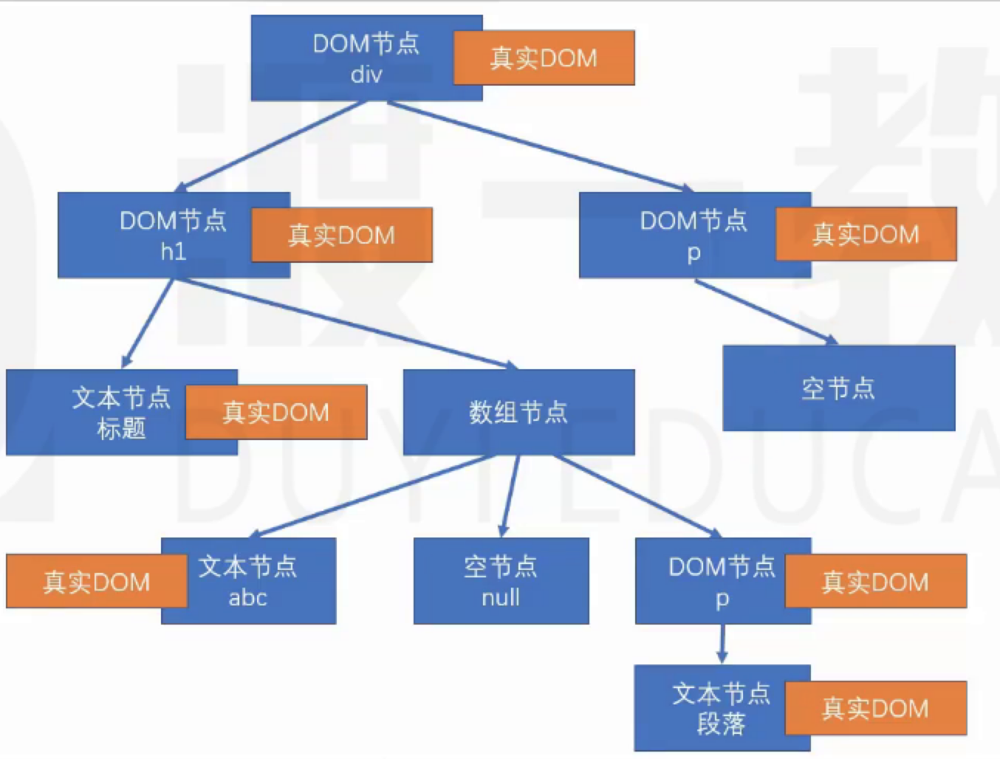

[TOC]
***


### 一、渲染

渲染：生成用于显示的对象，以及将这些对象形成真实的Dom对象。

- React 元素：React Element，通过 React.createElement 创建（语法糖：JSX）
- React 节点：专门用于渲染到UI界面的对象，React元素会通过React元素，创建React节点。ReactDOM 一定是通过react节点来进行渲染的。
  - 节点类型（type属性）：
    - React Dom节点：创建该节点的React元素类型是一个字符串。
    - React 组件节点：创建该节点的React元素类型是一个函数或是一个类。
    - React 文本节点：字符串、数字。
    - React 空节点：null，undefined，Boolean
    - React 数组节点：该节点由一个数组创建。
- 真实DOM：通过document.createElement创建的dom对象。

### 二、首次渲染（新节点渲染）

1. 通过参数的值创建节点
2. 根据不同的节点，做不同的事情
    1. 文本节点：通过 document.createTextNode 创建真实的文本节点。
    2. 空节点：什么都不做
    3. 数组节点：遍历数组，将数组每一项递归创建节点（回到第一步进行发反复操作，直到遍历结束）。
    4. DOM节点：通过 document.createElement 创建真实的DOM对象，然后立即设置该真实dom元素的各种属性，然后遍历对应React元素的Children属性，递归操作（回到第一步进行反复操作，直到遍历结束）
    5. 组件节点
        1. 函数组件：调用函数(该函数，必须返回一个可以生成节点的内容)，将该函数的返回结果递归生成节点(回到第一步进行反复操作，直到遍历结束)。
        2. 类组件：
            1. 创建该类的实例。
            2. 立即调用对象的生命周期方法：static getDerivedStateFromProps
            3. 运行该对象的render方法，拿到节点对象（将该节点递归操作，回到第一步反复操作）
            4. 将该组件的 componentDidMount 加入到执行队列（先进先出，先进先执行），当整个虚拟dom树完全构建完成，并且将真实的dom对象加入到容器之后，执行该队列。
3. 生成出虚拟dom树之后，将该树保存起来，以便后续使用
4. 将之前生成的真实的dom对象，加入到容器中。


```JS
const app = (
  <div className="name">
    <h1>
      标题
      {['abc', null, <p>fwibhfew</p>]}
    </h1>
    <p>{undefined}</p>
  </div>
);
console.log('app:', app);
ReactDOM.render(app, document.getElementById('root'));
```
以上代码生成的虚拟dom树：


### 三、更新节点

**更新的场景：**
1. 重新调用 ReactDOM.render 完全重新生成节点树。
    1. 触发根节点更新
2. 在类组件中调用 setState 
**节点的更新**
- 如果调用的是ReactDOM.render，进入根节点的对比（diff）更新
- 如果调用的是 setState
  - 1. 运行声明周期函数，static getDerivedStateFromProps
  - 2. 运行 shouldComponentUpdate ，如果该函数返回 false，终止当前流程。
  - 3. 运行 render，得到一个新的节点，进入该新的节点的**对比更新**
  - 4. 将生命周期函数 getSnapshotBeforeUpdate 加入执行队列，以待将来执行
  - 5. 将生命周期函数 componentDidUpdate 加入执行队列，以待将来执行

**后续步骤：**
  - 1. 完成真实的dom更新
  - 2. 依次调用执行队列中的 componentDidMount
  - 2. 依次调用执行队列中的 getSnapshotBeforeUpdate
  - 3. 依次调用执行队列中的 componentDidUpdate
  - 4. 依次调用执行队列中的 componentWillUnMount

### 四、对比更新

将新产生的节点，对比之前虚拟dom中的节点，发现差异，完成更新。

问题：对比之前dom树中哪个节点

React 为了提高对比效率，做出以下假设：
1. 假设节点不会出现层次的移动。(对比时，直接找到旧树中对应位置的节点进行对比)
2. 不同的节点类型会生成不同的结构
    1. 相同的节点类型：节点本身类型相同，如果是组件节点，组件类型也必须相同。
    2. 其他的，都属于不相同的节点类型。
3. 多个兄弟通过唯一标识（key）来确定对比的新节点。

#### 1.找到了对比的目标

1. 判断节点类型是否一致。

- **一致**

根据不同的节点类型，做不同的事情。

**空节点**： 不做任何事情

**DOM节点**： 直接使用之前的真实dom对象
1. 直接重用之前的真实dom对象
2. 将其属性的变化记录下，以待将来统一完成更新（现在不会真正的变化）
3. 遍历该 React 元素的子元素，递归对比更新

- **不一致**

#### 2.没有找到对比的目标
