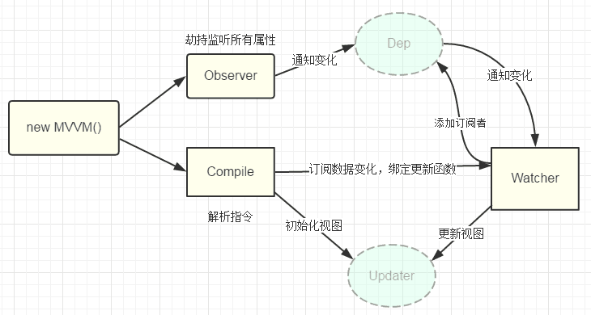

[TOC]

---


JavaScript 中的 MVC、MVP、MVVM： https://www.cnblogs.com/linjunfu/p/14495821.html

### 一、MVC

**服务器MVC**

1. **Modal**：数据模型，需要用于UI渲染的模型。
2. **View**：视图，生成完整的HTML，返回给客户端
3. **Controller**：服务器收到一个请求，将不同的请求分发到对应的**Controller**：控制器，处理请求，组装这次请求需要的数据

在HTML5 还未火起来的那些年，MVC 作为Web 应用的最佳实践是OK 的，这是因为 Web 应用的View 层相对来说比较简单，前端所需要的数据在后端基本上都可以处理好，View 层主要是做一下展示，那时候提倡的是 Controller 来处理复杂的业务逻辑，所以View 层相对来说比较轻量，就是所谓的瘦客户端思想。

相对 HTML4，HTML5 最大的亮点是**它为移动设备提供了一些非常有用的功能**，使得 HTML5 具备了开发App的能力， HTML5开发App 最大的好处就是**跨平台、快速迭代和上线，节省人力成本和提高效率**，因此很多企业开始对传统的App进行改造，逐渐用H5代替Native，到2015年的时候，市面上大多数App 或多或少嵌入都了H5 的页面。既然要用H5 来构建 App， 那View 层所做的事，就不仅仅是简单的数据展示了，它不仅要管理复杂的数据状态，还要处理移动设备上各种操作行为等等。因此，前端也需要工程化，也需要一个类似于MVC 的框架来管理这些复杂的逻辑，使开发更加高效。 但这里的 MVC 又稍微发了点变化：

1. 视图（View）：用户界面（用户进行事件操作）。
2. 控制器（Controller）：业务逻辑（响应请求，执行事件逻辑，即修改Model数据）
3. 模型（Model）：数据保存（数据更新后，Model操作HTML页面更新，即渲染并展示页面）

> 实际使用中，HTML 中可能还会绕过 Controller.js，直接调用 Model.js 操作数据，这样 HTML 中会包含一些业务逻辑

这种MVC架构模式对于简单的应用来说是ok的，也符合软件架构的分层思想。但实际上，随着H5的不断发展，人们更希望用H5开发的应用能和Native媲美，或者接近于原生APP的体验效果，于是前端应用的复杂程度已不同往日。这时前端暴露出三个痛点：
1. 开发者在代码中大量调用相同的DOM API，处理频繁，操作冗余，使得代码难以维护。
2. 大量的DOM操作使页面渲染性能降低，加速速度变慢，影响用户体验
3. 当Model频繁发生变化，开发者需要主动更新到View；当用户的操作导致Model发生变化，开发者同样需要将变化的数据同步到Model中，这样的工作不仅繁琐，而且很难维护复杂多变的数据状态。

> 其实，早起的jquery的出现就是为了前端能更简洁的操作DOM而设计的，但它只解决了第一个问题，例外两个问题始终伴随着前端一直存在。

### 二、MVP

MVP 模式将Controller 改名为Presenter，同时改变了通信方向。

1. 各部分之间的通信，都是双向的。
2. View 与 Model 不发生联系，都通过 Presenter 传递。
3. View 非常薄，不部署任何业务逻辑，称为"被动视图"（Passive View），即没有任何主动性，而 Presenter非常厚，所有逻辑都部署在那里。

**MVP与MVC区别：**
* MVC中Model可以与View直接交互
* MVP中Model与View完全解耦，交互完全交给Presenter
* 我们得目的是实现 ```UI展示（CSS HTML）、逻辑（UI动态交互逻辑和业务逻辑）和数据隔离开```，那么mvc是否能够实现呢？
  * 不行，因为Model调用View提供的方法，两者耦合在一起了，若View方法改变，Model需要随之改变。
  * 因为UI的交互逻辑是多变的，而Model的操作方式是不容易变的，所以UI的交互逻辑不应该放在Model中，应该提取到Presenter中处理。
  * 而MVP是通过Presenter实现UI的交互逻辑，若UI有变化，Model不需要改动，修改Presenter即可。


### 三、MVVM

**MVVM 的出现，完美解决了以上三个问题**

> MVVM（Model-View-ViewModel）是对MVC（Model-View-Control）和MVP（Model-View-Presenter）的进一步改进。

1. View：视图层（UI组件，负责将数据模型转化成UI 展现出来）
2. Model：数据模型
3. ViewModel：业务逻辑层（同步View 和 Model的对象）

**在MVVM架构下，View和Model之间并没有直接的联系，而是通过ViewModel进行交互的，Model和ViewModel之间的交互是双向的，因此View数据的变化会同步到Model中，而Model数据的变化也会立即反应到View上。**

ViewModel通过双向数据绑定把View层和Model层连接起来，而View和Model之间的同步工作完全是自动的，无需人为干涉，因此开发者只需要关注业务逻辑，不需要手动操作DOM，不需要关注数据状态的同步问题，复杂的数据状态维护完全由MVVM来统一管理。

#### 1.vue中的MVVM架构的最佳实践

Vue.js 可以说是MVVM 架构的最佳实践，专注于 MVVM 中的 ViewModel，不仅做到了数据双向绑定，而且也是一款相对来比较轻量级的JS 库，API 简洁，很容易上手

Vue.js是采用 Object.defineProperty的getter和setter，并结合观察者模式来实现数据绑定的。当把一个普通的js对象传给Vue实例来作为它的data选项时，Vue将遍历它的属性，用Object.defineProperty将他们转换为getter、setter。用户看不到getter、setter，但是在内部他们让Vue追踪依赖，在属性被访问和修改时通知变化。

每个组件实例都对应一个watcher实例，它会在组件渲染的过程中把'接触'过的数据，property记录为依赖。之后当依赖项的setter触发时，会通知watcher，从而使它关联的组件重新渲染。

深入理解：
* Observer: 数据监听器，能能对数据对象（data）的所有属性进行监听，如有变动可拿到更新并通知订阅者，内部采用Object.defineProperty的getter和setter来实现
> 这样的话，给这个对象的某个值赋值，就会触发 setter，那么就能监听到了数据变化。
* Compile：指令解析器，将模板中的变量都替换成数据，然后初始化渲染页面视图，并将每一个指令对应的节点绑定更新函数，添加监听数据的订阅者。
> 一旦数据有变动，收到通知，调用更新函数进行数据更新。
* Wather：订阅者，作为连接Observer和Compile的桥梁，能够订阅并收到每个属性变动的通知，执行指令绑定的响应回调函数。
> 当收到属性值变化的消息时，触发解析器 Compile 中对应的更新函数。每个组件实例都有相应的 watcher 实例对象，它会在组件渲染的过程中把属性记录为依赖，
之后当依赖项的 setter 被调用时，会通知 watcher 重新计算，从而致使它关联的组件得以更新——这是一个典型的观察者模式。
* Dep：消息订阅器，内部维护了一个数组，用来收集订阅者（Wather），对监听器 Observer 和 订阅者 Watcher 进行统一管理。数据变动触发notify函数，再调用订阅者的update方法。



从图中可以看出，**当执行 new Vue() 时，Vue 就进入了初始化阶段，一方面Vue 会遍历 data 选项中的属性，并用 Object.defineProperty 将它们转为 getter/setter，实现数据变化监听功能；另一方面，Vue 的指令编译器Compile 对元素节点的指令进行扫描和解析，初始化视图，并订阅 Watcher 来更新视图， 此时Wather 会将自己添加到消息订阅器中(Dep)，初始化完毕。**

**当数据发生变化时，Observer 中的 setter 方法被触发，setter 会立即调用Dep.notify()，Dep 开始遍历所有的订阅者，并调用订阅者的 update 方法，订阅者收到通知后对视图进行相应的更新。**


#### 2.Vue3.x响应式数据原理吗

Vue3.x改用Proxy替代Object.de-fineProperty。

因为Proxy可以直接监听对象和数组的变化，并且有多达13种拦截方法。并且作为新标准将受到浏览器厂商重点持续的性能优化。

Proxy只会代理对象的第一层，Vue3是怎样处理这个问题的呢？

判断当前Reflect.get的返回值是否为Object，如果是则再通过reactive方法做代理， 这样就实现了深度观测。

监测数组的时候可能触发多次get/set，那么如何防止触发多次呢？我们可以判断key是否为当前被代理对象target自身属性，也可以判断旧值与新值是否相等，只有满足以上两个条件之一时，才有可能执行trigger。

***Proxy和Object.defineProperty优劣对比***

Proxy可以直接监听对象而非属性。
Proxy可以直接监听数组的变化
Proxy有多达13种拦截方法，不限于apply，ownKeys，deleteProperty，has等是Object.defineProperty不具备的
Proxy返回的是一个新的对象，我们可以只操作新的对象达到目的，而Object.defineProperty只能遍历对象属性直接修改。
Proxy作为新标准将受到浏览器厂商重点持续的性能优化，也就是传说中的新标准的新能红利。

***Object.defineProperty 的优势如下:***
兼容性好，支持 IE9，而 Proxy 的存在浏览器兼容性问题,而且无法用 polyfill 磨平，因此 Vue 的作者才声明需要等到下个大版本( 3.0 )才能用 Proxy 重写。

### 四、总结

* MVC是 ```View视图 -> Controller控制器 -> Model模型 -> View视图``` 单方向流程结构，目的为分离 ```View视图与Model模型```，但是实际使用过程中。```View视图与Model模型```分的不够彻底，依旧有耦合行为。
* MVP 为解决这个问题，重新定义了```Controller控制器```为```Presenter中间人```,彻底分离了```View视图与Model模型```，两者之间的交互全部由 ```Presenter中间人```处理。
* MVVM是MVP的演进，其中```VM```是对```Presenter中间人```的部分功能的自动化提取，例如HTML的操作全部由VM来做，解放我们的双手，我们只需要关注数据的变化即可。
