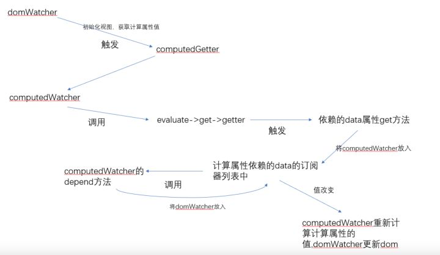

[TOC]
***

### 一、Vuex是什么？

Vuex 是专门为Vuejs应用程序设计的状态管理工具。它采用集中式存储管理应用的所有组件的状态，并以相应的规则保证状态以一种可预测的方式发生变化。

### 二、Vuex的设计思想

Vuex的设计思想，借鉴了Flux，Redux，将数据存放到全局的store，再将store挂载到每个vue实例组件中，利用vuejs的细粒度数据响应机制来进行高效的状态更新。

看了Vuex设计思想，心里难免会有这样的疑问：
* vuex的store是如何挂载注入到组件中呢？
* vuex的state和getters是如何映射到各个组件实例中响应式更新状态呢？

### 三、Vuex的原理解析

#### 1）vuex的store是如何挂载注入到组件中？
1. 在vue项目中先安装vuex，核心代码如下：
```JS
import Vuex from 'vuex'
Vue.use(vuex); // vue的插件机制
```
2. 利用vue的插件机制，使用Vue.use(vuex)时，会调用vuex的install方法，装载vuex，install方法的代码如下：
```JS
export function install (_Vue) {
  if (Vue && _Vue === Vue) {
    if (process.env.NODE_ENV !== 'production') {
      console.error(
        '[vuex] already installed. Vue.use(Vuex) should be called only once.'
      )
    }
    return
  }
  Vue = _Vue
  applyMixin(Vue)
}
```
3. applyMixin方法使用vue混入机制，vue生命周期beforeCreate钩子函数前混入vuexInit方法
```JS
Vue.mixin({ beforeCreate: vuexInit });

function vuexInit () {
    const options = this.$options
    // store injection
    if (options.store) {
      this.$store = typeof options.store === 'function'
        ? options.store()
        : options.store
    } else if (options.parent && options.parent.$store) {
      this.$store = options.parent.$store
    }
}
```

分析源码，我们知道了vuex是利用vue的mixin混入机制，在beforeCreate钩子前混入vuexInit方法，vuexInit方法实现了store注入vue组件实例，并注册了vuex store的引用属性$store.

#### 2）vuex的state和getters是如何映射到各个组件实例中响应式更新状态呢？

源码中resetStoreVM核心方法
```JS
function resetStoreVM (store, state, hot) {
  const oldVm = store._vm

  // 设置 getters 属性
  store.getters = {}
  const wrappedGetters = store._wrappedGetters
  const computed = {}
  // 遍历 wrappedGetters 属性
  forEachValue(wrappedGetters, (fn, key) => {
    // 给 computed 对象添加属性
    computed[key] = partial(fn, store)
    // 重写 get 方法
    // store.getters.xx 其实是访问了store._vm[xx]，其中添加 computed 属性
    Object.defineProperty(store.getters, key, {
      get: () => store._vm[key],
      enumerable: true // for local getters
    })
  })

  const silent = Vue.config.silent
  Vue.config.silent = true
  // 创建Vue实例来保存state，同时让state变成响应式
  // store._vm._data.$$state = store.state
  store._vm = new Vue({
    data: {
      $$state: state
    },
    computed
  })
  Vue.config.silent = silent

  // 只能通过commit方式更改状态
  if (store.strict) {
    enableStrictMode(store)
  }
}
```

从上面源码中，我们可以看出vuex的state状态是响应式的，是借助vue的data是响应式，将state存入vue实例组件的data中；Vuex的getters则是借助vue的计算属性computed实现数据实时监听。



#### 3)小结

Vuex是通过全局注入store对象，来实现组件间的状态共享。在大型复杂的项目中（多级组件嵌套），需要实现一个组件更改某个数据，多个组件自动获取更改后的数据进行业务逻辑处理，这时候使用vuex比较合适。假如只是多个组件间传递数据，使用vuex未免有点大材小用，其实只使用组件间常用的通信方式即可。


### 四、核心属性

#### 1.state

state是存储的单一状态，是存储的基本数据

在组件中使用state：
```JS
// 在单独构建的版本中辅助函数为 Vuex.mapState
import { mapState } from 'vuex'
export default {
  // ...
  computed: {
    ...mapState({
    // 箭头函数可使代码更简练
    count: state => state.count,

    // 传字符串参数 'count' 等同于 `state => state.count`
    countAlias: 'count',

    // 为了能够使用 `this` 获取局部状态，必须使用常规函数
    countPlusLocalState (state) {
      return state.count + this.localCount
    }
  }),

  // 或者
  ...mapState([
    // 映射 this.count 为 store.state.count
    'count'
  ])
  }
}
```

#### 2.getters

getters是store的计算属性，对state的加工，是派生出来的数据。就像computed计算属性一样，getter返回的值会根据他的依赖被缓存起来，且只有当它的依赖值发生改变才会被重新计算。

```JS
const store = new Vuex.Store({
  state: {
    list: [1, 3, 5, 7, 9, 20, 30]
  },
  getters: {
    filteredList: state => {
      return state.list.filter(item => item > 5)
    },
    listCount: (state, getters) => {
      return getters.filteredList.length;
    }
  }
})
```
在组件中使用getters：
```HTML
<script>
  export default {
    name: "index.vue",
    computed: {
      list() {
        return this.$store.getters.filteredList;
      }
    }
  }
</script>
```
使用 mapGetters 辅助函数：
```JS
import { mapGetters } from 'vuex'

export default {
  computed: {
    // 使用对象展开运算符将 getter 混入 computed 对象中
    ...mapGetters([
      'doneTodosCount',
      'anotherGetter',
      // ...
    ])

    // 或者
    ...mapGetters({
      // 把 `this.doneCount` 映射为 `this.$store.getters.doneTodosCount`
      doneCount: 'doneTodosCount'
    })
  }
}
```

#### 3.mutations

mutations提交更改数据，使用store.commit方法更改state存储的状态。（mutations同步函数）

```JS
const store = new Vuex.Store({
  state: {
    count: 1
  },
  mutations: {
    increment (state, n) {
      // 变更状态
      state.count += n;
    }
  }
})

store.commit('increment', 10);
```
在组件中使用mutations
```JS
import { mapMutations } from 'vuex'

export default {
  // ...
  methods: {
    ...mapMutations([
      'increment', // 将 `this.increment()` 映射为 `this.$store.commit('increment')`

      // `mapMutations` 也支持载荷：
      'incrementBy' // 将 `this.incrementBy(amount)` 映射为 `this.$store.commit('incrementBy', amount)`
    ]),
    ...mapMutations({
      add: 'increment' // 将 `this.add()` 映射为 `this.$store.commit('increment')`
    })
  }
}
```

#### 4.actions

Action 类似于 mutation，不同在于：
* Action 提交的是 mutation，而不是直接变更状态。
* Action 可以包含任意异步操作。

注册action：
```JS
const store = new Vuex.Store({
  state: {
    count: 0
  },
  mutations: {
    increment (state) {
      state.count++
    }
  },
  actions: {
    increment (context) {
      context.commit('increment')
    },
    actionA ({ commit }) {
      return new Promise((resolve, reject) => {
        setTimeout(() => {
          commit('someMutation')
          resolve()
        }, 1000)
      })
    }
  }
})

// 分发
store.dispatch('increment');

// 以载荷形式分发
store.dispatch('incrementAsync', {
  amount: 10
})

// 以对象形式分发
store.dispatch({
  type: 'incrementAsync',
  amount: 10
})
```

在组件中分发actions
```JS
import { mapActions } from 'vuex'

export default {
  // ...
  methods: {
    ...mapActions([
      'increment', // 将 `this.increment()` 映射为 `this.$store.dispatch('increment')`

      // `mapActions` 也支持载荷：
      'incrementBy' // 将 `this.incrementBy(amount)` 映射为 `this.$store.dispatch('incrementBy', amount)`
    ]),
    ...mapActions({
      add: 'increment' // 将 `this.add()` 映射为 `this.$store.dispatch('increment')`
    })
  }
}
```

#### 5.modules

```JS
const moduleA = {
  state: () => ({ ... }),
  mutations: { ... },
  actions: { ... },
  getters: { ... }
}

const moduleB = {
  state: () => ({ ... }),
  mutations: { ... },
  actions: { ... }
}

const store = new Vuex.Store({
  modules: {
    a: moduleA,
    b: moduleB
  }
})

store.state.a // -> moduleA 的状态
store.state.b // -> moduleB 的状态
```

使用命名空间 namespaced，实现高度模块化
```JS
const store = new Vuex.Store({
  modules: {
    account: {
      namespaced: true,

      // 模块内容（module assets）
      state: () => ({ ... }), // 模块内的状态已经是嵌套的了，使用 `namespaced` 属性不会对其产生影响
      getters: {
        isAdmin () { ... } // -> getters['account/isAdmin']
      },
      actions: {
        login () { ... } // -> dispatch('account/login')
      },
      mutations: {
        login () { ... } // -> commit('account/login')
      },

      // 嵌套模块
      modules: {
        // 继承父模块的命名空间
        myPage: {
          state: () => ({ ... }),
          getters: {
            profile () { ... } // -> getters['account/profile']
          }
        },

        // 进一步嵌套命名空间
        posts: {
          namespaced: true,

          state: () => ({ ... }),
          getters: {
            popular () { ... } // -> getters['account/posts/popular']
          }
        }
      }
    }
  }
})
```
