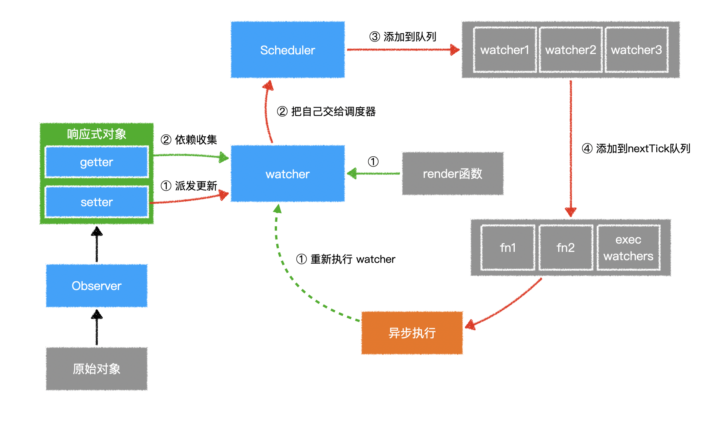

[TOC]

---

响应式数据的最终目标，是当对象本身或对象属性发生变化时，将会运行一些函数，最常见的就是render函数。

在具体实现上，vue用到了几个核心部件：
1. Observer
2. Dep
3. Watcher
4. Scheduler

#### 一、Observer

Observer 要实现的目标非常简单，就是把一个普通的对象转换为响应式对象。

为了实现这一点，Observer把对象的每个属性通过 Object.defineProperty 转换为带有getter和setter的属性，这样一来，当访问或设置属性时，vue就有机会做一些别的事情。

Observer 是vue内部的构造器，我们可以通过vue提供的静态方法 Vue.observable(object) 间接的使用该功能。

在组件的生命周期中，这件事发生在beforeCreate之后，created之前。

具体实现上，它会递归遍历对象的所有属性，以完成深度的属性转换。

由于遍历时只能遍历到对象的当前属性，因此无法监听到将来动态增加或删除的属性，因此vue提供了$set和$delete两个实例方法，让开发者通过这两个实例方法对已有响应式对象添加或删除属性。

对于数组，vue会更改它的隐式原型，之所以这样做，是因为vue需要监听那些可能改变数组内容的方法。

总之，Observer的目标，就是要让一个对象，它的属性的读取、赋值，内部数组的变化都要能够被vue感知到。

#### 二、Dep

这里有两个问题没有解决，就是读取属性时要做什么事，而属性变化时要做什么事，这个问题需要依赖Dep来解决。

Dep的含义是Dependency，表示依赖的意思。

Vue会为响应式对象中的每个属性、对象本身、数组本身创建一个Dep实例，每个Dep实例都有能够做以下两件事：
* 记录依赖：是谁在用我 dep.depend()
* 派发更新：我变了，我要通知哪些用到我的人 dep.notify()

当读取响应式对象的某个属性时，他会进行依赖收集：有人用到了我
当改变某个属性时，他会派发更新：那些用我的人听好了，我变了

**示例1：**
```JS
{ // dep (负责整个对象的监听变化)
  title: 'hello dep', // dep （负责这个属性的监听变化）
  // dep （user属性本身）
  user: { // dep （user对象本身）
    age: '', // dep
  },
  name: 'du', // dep
  // dep
  hobbies: ['12', '34'], // dep
}
```

**示例2：**
```JS
var vm = new Vue({
  el: '#app',
  data: {
    title: 'hello world',
    user: { // dep [render]
      name: 'm', // dep [render]
    },
    hobbiles: ['12', '34']
  },
  // vm.$set(vm.user, 'age', 12); 会导致render运行（其实不应该）
  // 即user对象dep中记录的render，原因在于vue不知道$set设置的是哪个属性。
  render(h) {
    return h('h1', `${this.user.name}`);
  }
})
```

#### 三、Watcher

这里又出现一个问题，就是Dep如何知道是谁在用我？

要解决这个问题，需要依靠另一个东西，就是Watcher。

当某个函数执行的过程中，用到了响应式数据，响应式数据是无法知道是哪个函数在用自己的。

因此，vue通过一种巧妙的办法来解决这个问题。

我们不要直接执行函数，而是把函数交给一叫做watcher的东西去执行，watcher是一个对象，每个这样的函数，执行时都应该创建一个watcher，通过watcher去执行。

watcher会设置一个全局变量，让全局变量记录当前负责执行的watcher等于自己，然后再去执行函数，在函数执行过程中，如果发生了依赖记录dep.depend()，那么Dep就会把这个全局变量记录下来，表示：有一个watcher用到了我这个属性。

当dep进行派发更新时，他会通知之前记录的所有watcher：我变了。

每一个vue组件实例，都至少对应一个watcher，该watcher中记录了该组件的render函数。

watcher首先会把render函数运行一次以收集依赖，于是那些在render中用到的响应式数据就会记录这个watcher。

当数据变化时，dep就会通知这个watcher，而watcher将重新运行render函数，从而让界面重新渲染同时重新记录当前的依赖。

#### 四、Scheduler

现在还剩下最后一个问题，就是Dep通知watcher之后，如果watcher执行重运行对应的函数，就有可能导致函数频繁运行，从而导致效率低下。

试想，如果一个交给watcher的函数，它里面用到了属性a，b，c，d，那么这几个属性都会记录依赖，于是下面的代码将触发4次更新。
这样显然是不合适的，因此，watcher收到派发更新通知后，实际上不是立即执行对应的函数，而是把自己交给一个叫做调度器的东西。

调度器维护一个执行队列，该队列同一个watcher仅会存在一次，队列中的watcher不是立即执行，他会通过一个叫做nextTick的工具方法，把那些需要执行的watcher放入到事件循环的微队列找那个，nextTick的具体做法是通过Promise完成。

> nextTick通过this.$nextTick暴露给开发者。

也就是说，当响应式数据变化时，render函数的执行是异步的，并且在微队列中


