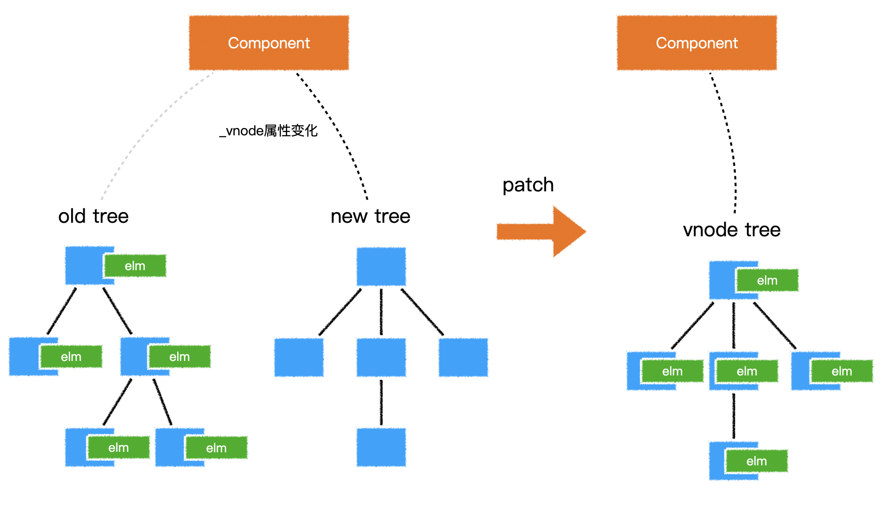

[TOC]

---

当组件创建和更新时，vue均会执行内部内部的update函数，该函数使用render函数生成的虚拟dom树，将新旧两树进行对比，找到差异点，最终更新到真实dom。

对比差异的过程叫做diff，vue在内部通过一个叫做patch的函数完成该过程

在对比时，vue采用深度优先、同层比较的方式进行比对。

在判断两个节点是否相同时，vue是通过虚拟节点的key和tag来进行判断的。

具体来说，首先对根节点进行对比，如果相同则将旧节点关联的真实的dom挂到新节点上，然后根据需要更新属性到真实dom，然后再对比其子节点数组；如果不相同，则按照新节点的信息递归创建所有真实的dom，同时挂到对应虚拟节点上，然后移除掉旧的dom。

在对比其子节点数组时，vue对每个子节点数组使用了两个指针，分别指向头尾，然后不断向中间靠拢来进行对比，这样做的目的是尽量复用真实的dom，尽量少的销毁和创建真实dom。如果发现相同，则进入和根节点一样的对比流程，如果发现不同，则移动真实dom到合适的位置。

这样一直递归的遍历下去，直到整棵树完成对比。

#### 1. diff的时机

当组件创建时，以及依赖的属性或数据变化时，会运行一个函数，该函数会做两件事：
* 运行_render生成一棵新的虚拟dom树（vnode tree）
* 运行_update，传入虚拟dom树的根节点，对新旧两棵树进行对比，最终完成对真实dom的更新。

核心代码如下：
```JS
function Vue() {
  // 其他代码
  var updateComponent = () => {
    this._update(this._render());
  }
  new Watcher(updateComponent);
  // 其他代码
}
```

#### 2._update函数在干什么？

_update函数接收到一个vnode参数，这就是新生成的虚拟dom树，同时，_update函数通过当前组件的_vnode属性，拿到旧的虚拟dom树，_update函数首先会给组件的_vnode属性重新赋值，让他指向新树。

然后判断旧树是否存在：
* 不存在：说明这是第一次加载组件，于是通过内部的patch函数，直接遍历新树，为每个节点生成真实dom，挂载到每个节点的elm属性上。
* 存在：说明之前已经渲染过该组件，于是通过内部的patch函数，对新旧两棵树进行对比，以达到下面两个目标：
  * 完成对所有真实dom的最小化处理
  * 让新树的节点对应合适的真实dom



#### 3.patch函数的对比流程

> 术语解释：
A.「相同」：是指两个虚拟节点的标签类型、key值均相同，input元素还要看type属性
B.「新建元素」：是指根据一个虚拟节点提供的信息，创建一个真实dom元素，同时挂载到虚拟节点的elm属性上。
C.「销毁元素」：是指：vnode.elm.remove()
D.「更新」：是指对两个虚拟节点进行对比更新，它仅发生在两个虚拟节点「相同」的情况下。具体过程稍后描述
E.「对比子节点」：是指对两个虚拟节点的子节点进行对比，具体过程稍后描述。

***详细流程：***

**A. 根节点比较**
patch函数首先对根节点进行比较：
如果两个节点：
* 「相同」，进入「更新」流程
  1. 将旧节点的真实dom赋值到新节点：newVnode.elm = oldVnode.elm
  2. 对比新节点和旧节点的属性，有变化的更新到真实dom中
  3. 当前两个节点处理完毕，开始「对比子节点」
* 不「相同」
  1. 新节点递归「新建元素」
  2. 旧节点「销毁元素」

**B. 对比子节点**
在「对比子节点」时，vue一切的出发点，都是为了：
* 尽量啥也别做
* 不行的话，尽量仅改动元素属性
* 还不行的话，尽量转移元素，而不是删除和创建元素
* 还不行的话，删除和创建元素


#### 4.patch算法核心

```JS
function patch (oldVnode, vnode) {
  // some code
  if (sameVnode(oldVnode, vnode)) {
    patchVnode(oldVnode, vnode)
  } else {
    const oEl = oldVnode.el // 当前oldVnode对应的真实元素节点
    let parentEle = api.parentNode(oEl)  // 父元素
    createEle(vnode)  // 根据Vnode生成新元素
    if (parentEle !== null) {
      api.insertBefore(parentEle, vnode.el, api.nextSibling(oEl)) // 将新元素添加进父元素
      api.removeChild(parentEle, oldVnode.el)  // 移除以前的旧元素节点
      oldVnode = null
    }
  }
  // some code
  return vnode
}
```

```JS
// 用于比对是否是同一VNode
function sameVnode (a, b) {
  return (
    a.key === b.key && ( // key值
      (
        a.tag === b.tag && // 标签名
        a.isComment === b.isComment && // 是否为注释节点
        // 是否都定义了data，data包含一些具体信息，例如onclick , style
        isDef(a.data) === isDef(b.data) &&
        sameInputType(a, b) // 当标签是<input>的时候，type必须相同
      ) || (
        isTrue(a.isAsyncPlaceholder) &&
        a.asyncFactory === b.asyncFactory &&
        isUndef(b.asyncFactory.error)
      )
    )
  )
}
```

patch函数接收两个参数oldVnode和Vnode分别代表新的节点和之前的旧节点，判断两节点是否值得比较，值得比较则执行patchVnode，不值得比较则用Vnode替换oldVnode

**patchVnode过程**
```JS
patchVnode (oldVnode, vnode) {
  const el = vnode.el = oldVnode.el
  let i, oldCh = oldVnode.children, ch = vnode.children
  if (oldVnode === vnode) return
  if (oldVnode.text !== null && vnode.text !== null && oldVnode.text !== vnode.text) {
    api.setTextContent(el, vnode.text)
  }else {
    updateEle(el, vnode, oldVnode)
    if (oldCh && ch && oldCh !== ch) {
      updateChildren(el, oldCh, ch)
    }else if (ch){
      createEle(vnode) //create el's children dom
    }else if (oldCh){
      api.removeChildren(el)
    }
  }
}
```
* 找到对应的真实dom，称为el 
* 判断Vnode和oldVnode是否指向同一个对象，如果是，那么直接return 
* 如果他们都有文本节点并且不相等，那么将Vnode的文本节点设置为el的文本节点。 
* 如果oldVnode有子节点而Vnode没有，则删除el的子节点 
* 如果oldVnode没有子节点而Vnode有，则将Vnode的子节点真实化之后添加到el 
* 如果两者都有子节点，则执行updateChildren函数比较子节点

**updateChildren过程**
这一部分可以说是 diff 算法中，变动最多的部分，因为前面的部分，各个库对比的方向基本一致，而关于子节点的对比，各个仓库都在前者基础上不断得进行改进，此处以Vue源码的 updateChildren 为例。
```JS
updateChildren (parentElm, oldCh, newCh) {
    let oldStartIdx = 0, newStartIdx = 0
    let oldEndIdx = oldCh.length - 1
    let oldStartVnode = oldCh[0]
    let oldEndVnode = oldCh[oldEndIdx]
    let newEndIdx = newCh.length - 1
    let newStartVnode = newCh[0]
    let newEndVnode = newCh[newEndIdx]
    let oldKeyToIdx
    let idxInOld
    let elmToMove
    let before
    while (oldStartIdx <= oldEndIdx && newStartIdx <= newEndIdx) {
        if (oldStartVnode == null) {   // 对于vnode.key的比较，会把oldVnode = null
            oldStartVnode = oldCh[++oldStartIdx] 
        }else if (oldEndVnode == null) {
            oldEndVnode = oldCh[--oldEndIdx]
        }else if (newStartVnode == null) {
            newStartVnode = newCh[++newStartIdx]
        }else if (newEndVnode == null) {
            newEndVnode = newCh[--newEndIdx]
        }else if (sameVnode(oldStartVnode, newStartVnode)) {
            patchVnode(oldStartVnode, newStartVnode)
            oldStartVnode = oldCh[++oldStartIdx]
            newStartVnode = newCh[++newStartIdx]
        }else if (sameVnode(oldEndVnode, newEndVnode)) {
            patchVnode(oldEndVnode, newEndVnode)
            oldEndVnode = oldCh[--oldEndIdx]
            newEndVnode = newCh[--newEndIdx]
        }else if (sameVnode(oldStartVnode, newEndVnode)) {
            patchVnode(oldStartVnode, newEndVnode)
            api.insertBefore(parentElm, oldStartVnode.el, api.nextSibling(oldEndVnode.el))
            oldStartVnode = oldCh[++oldStartIdx]
            newEndVnode = newCh[--newEndIdx]
        }else if (sameVnode(oldEndVnode, newStartVnode)) {
            patchVnode(oldEndVnode, newStartVnode)
            api.insertBefore(parentElm, oldEndVnode.el, oldStartVnode.el)
            oldEndVnode = oldCh[--oldEndIdx]
            newStartVnode = newCh[++newStartIdx]
        }else {
           // 使用key时的比较
            if (oldKeyToIdx === undefined) {
                oldKeyToIdx = createKeyToOldIdx(oldCh, oldStartIdx, oldEndIdx) // 有key生成index表
            }
            idxInOld = oldKeyToIdx[newStartVnode.key]
            if (!idxInOld) {
                api.insertBefore(parentElm, createEle(newStartVnode).el, oldStartVnode.el)
                newStartVnode = newCh[++newStartIdx]
            }
            else {
                elmToMove = oldCh[idxInOld]
                if (elmToMove.sel !== newStartVnode.sel) {
                    api.insertBefore(parentElm, createEle(newStartVnode).el, oldStartVnode.el)
                }else {
                    patchVnode(elmToMove, newStartVnode)
                    oldCh[idxInOld] = null
                    api.insertBefore(parentElm, elmToMove.el, oldStartVnode.el)
                }
                newStartVnode = newCh[++newStartIdx]
            }
        }
    }
    if (oldStartIdx > oldEndIdx) {
        before = newCh[newEndIdx + 1] == null ? null : newCh[newEndIdx + 1].el
        addVnodes(parentElm, before, newCh, newStartIdx, newEndIdx)
    }else if (newStartIdx > newEndIdx) {
        removeVnodes(parentElm, oldCh, oldStartIdx, oldEndIdx)
    }
}
```

**图解updateChildren：**

https://zhuanlan.zhihu.com/p/407493321
